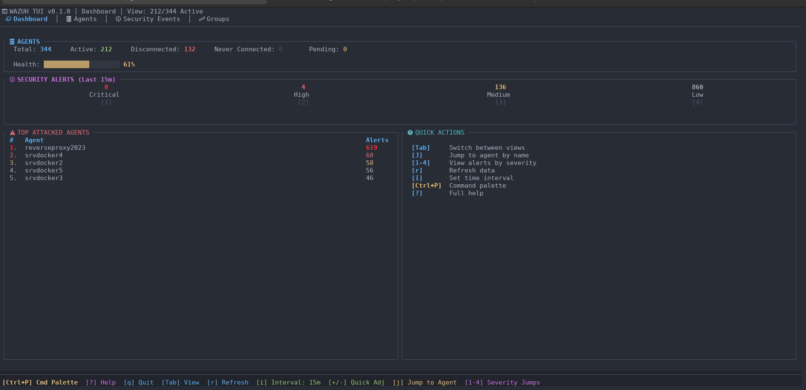
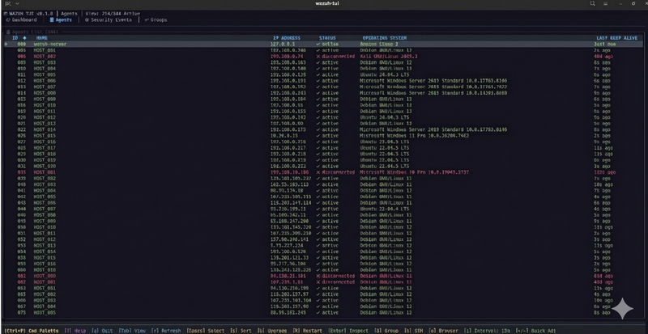

# Wazuh Rust TUI

A modern terminal user interface for managing Wazuh security agents, built with Rust.


## Features

- **Dashboard** - Real-time overview of threat statistics, alert history, and top agents by alerts
- **Agent Management** - Browse, search, filter, and inspect all Wazuh agents
- **Agent Inspector** - Detailed view with tabs for Hardware, Processes, Programs, Vulnerabilities, Logs, and Config
- **Security Events** - Browse and filter security logs with severity filtering and toggleable views (Table/Raw JSON)
- **Group Management** - View agent groups and assign agents to groups via the Agent List
- **SSH Integration** - Quick SSH access to agents directly from the TUI (requires compatible terminal)
- **Command Palette** - Quick access to actions and navigation via `Ctrl+p`
- **Agent Jump** - Quickly jump to specific agents using fuzzy search (`J`)
- **JSON Export** - Export security logs to JSON files
- **Colorized JSON** - Syntax-highlighted JSON display for logs and configs


## Screenshots

<p align="center">
    
</p>
<p align="center">
    
    <sub><i>This section displays an automatically anonymized screen using the 'A' key to protect sensitive data.</i></sub>
</p>

## Requirements

- Rust 1.70+ (https://www.rust-lang.org/)
- Access to a Wazuh API (v4.x)
- Wazuh API with valid credentials (username/password)
- Access to OpenSearch API (for security events/vulnerabilities)

## Installation

### From Source

```bash
git clone https://github.com/yourusername/wazuh-rust-tui.git
cd wazuh-rust-tui
make build
sudo make install
```

### Development

```bash
make run          # Build and run in debug mode
make check        # Quick syntax check
make test         # Run tests
make lint         # Run clippy linter
make fmt          # Format code
```

## Usage

Run `wazuh-rust-tui` from the terminal. On first launch, a configuration wizard will prompt you to enter:

1. Wazuh API URL (e.g., `https://wazuh-server:55000`)
2. OpenSearch URL (e.g., `https://wazuh-server:9200`)
3. Username
4. Password

Configuration is stored in `~/.config/wazuh-tui/config.toml`.

## Keybindings

### Global

| Key | Action |
|-----|--------|
| `Ctrl+p` | Open Command Palette |
| `Tab` | Switch between views |
| `?` | Toggle Help popup |
| `q` | Quit |
| `Esc` | Close popup / Cancel search / Back |

### Dashboard

| Key | Action |
|-----|--------|
| `1-4` | Filter by Critical/High/Med/Low vulnerabilities |
| `J` | Quick Jump to Agent (Fuzzy Search) |
| `r` | Refresh data |

### Agent List

| Key | Action |
|-----|--------|
| `/` | Search agents |
| `Space` | Toggle agent selection (multi-select) |
| `s` | Cycle sort order (ID/Name/IP/Status/OS) |
| `G` | Assign selected agent(s) to group |
| `U` | Upgrade selected agent(s) |
| `R` | Restart selected agent(s) |
| `h` | SSH to agent |
| `o` | Open agent in Wazuh web UI |
| `Enter` | Open Agent Inspector |

### Agent Inspector

| Key | Action |
|-----|--------|
| `Tab` | Switch between tabs |
| `q` | Return to Agent List |
| `f` | Filter logs by severity (in Logs tab) |
| `e` | Push config update (in Config tab) / Export logs (in Logs tab) |
| `Enter` | Show log detail (in Logs tab) |

### Security Events

| Key | Action |
|-----|--------|
| `v` | Toggle between Table and Raw JSON view |
| `f` | Filter by severity |
| `i` | Set specific time interval (e.g., "30m", "2h") |
| `+ / -` | Increase/Decrease time interval (15 min steps) |
| `e` | Export logs to JSON |
| `Enter` | Show log detail |

## Views

### Dashboard
Displays an overview with:
- Threat statistics (Critical/High/Medium/Low counts)
- Alert timeline histogram
- Top 5 agents by alert count
- Quick navigation to filtered agent views

### Agent List
Shows all registered agents with:
- Status indicators (Active/Disconnected/Pending/Never Connected)
- Agent name, ID, IP address
- OS information
- Last keep-alive timestamp
- Multi-select support for bulk operations

### Agent Inspector
Detailed agent view with six tabs:
- **Hardware**: CPU, RAM, OS details
- **Processes**: Running processes with CPU/memory usage
- **Programs**: Installed software packages
- **Vulnerabilities**: CVE information from OpenSearch
- **Logs**: Agent-specific security events
- **Config**: Agent configuration (editable)

### Security Events
Global security event browser with:
- Severity-based filtering
- Time interval selection
- Pagination support
- JSON export capability
- Detailed log inspection
- Toggleable views (Table / Raw JSON)

### Group Management
View and manage agent groups:
- List all groups with agent counts
- View agents in each group
- Assign agents to groups (from Agent List)

## Configuration

Configuration file location: `~/.config/wazuh-tui/config.toml`

```toml
[api]
url = "https://your-wazuh-server:55000"
opensearch_url = "https://your-wazuh-server:9200"
username = "wazuh-wui"
password = "your-password"
```

## Theme

The TUI uses a One Dark inspired color scheme optimized for terminal displays.

## License

MIT License - See LICENSE file for details.

## Contributing

Contributions are welcome! Please feel free to submit a Pull Request.
